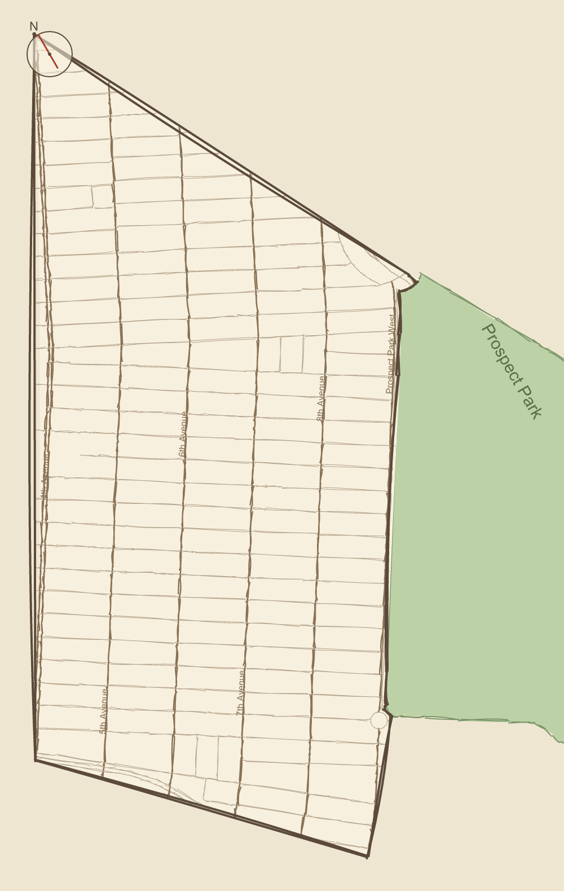

# Park Slope

An interactive, hand-drawn-style map of the Park Slope neighborhood in Brooklyn.
It is built from real OpenStreetMap geometry (so the borders and orientation are
accurate) and then styled to look illustrated rather than satellite-precise.

This is **Phase 1**: getting the neighborhood boundary, orientation, and overall
look and feel right. Highlighting institutions and neighborhood history will come
in a later phase.



## Quick start

```bash
npm install
npm run dev
```

Then open the printed local URL (default http://localhost:5173).

## Scripts

- `npm run dev` — start the Vite dev server.
- `npm run build` — type-check and build the production bundle into `dist/`.
- `npm run preview` — serve the production build locally.
- `npm run fetch-data` — refresh the committed map data from OpenStreetMap.

## How it works

```
OpenStreetMap (Overpass API)
        │  scripts/fetch-data.ts  (run on demand, not at runtime)
        ▼
src/data/*.geojson   ── boundary, Prospect Park, street grid (committed)
        │  src/lib/buildMap.ts (d3-geo projection + rough.js styling)
        ▼
src/components/NeighborhoodMap.tsx   ── structured, hand-drawn SVG
```

- **Data** lives as static GeoJSON in `src/data/` and is imported directly, so
  the running app never makes a network call.
- **`src/lib/projection.ts`** sets up a `d3-geo` Mercator projection fitted to
  the boundary, with a rotation (`DEFAULT_ANGLE`) so the avenues read vertically
  (4th Avenue on the west, Prospect Park West on the east).
- **`src/lib/roughen.ts`** turns projected SVG paths into sketchy, hand-drawn
  sub-paths using `rough.js`.
- **`src/lib/buildMap.ts`** is a pure builder shared by the app and the offline
  preview renderer. It produces a flat, serializable model of everything to draw
  (boundary, park, streets, labels, compass heading).
- **`src/components/NeighborhoodMap.tsx`** renders that model as a responsive
  SVG with named layers (`ps-layer--park`, `ps-layer--streets`, etc.), which
  makes attaching click/hover highlights in Phase 2 straightforward.

### The neighborhood boundary

`scripts/fetch-data.ts` stitches the boundary from real street geometry rather
than hardcoding corners. It uses the widely-accepted colloquial borders:

- North: Flatbush Avenue
- South: Prospect Expressway
- East: Prospect Park / Prospect Park West
- West: Fourth Avenue

It intersects those four streets to find the corners, and the eastern edge
follows Prospect Park's actual western boundary. To adjust the borders, edit the
constants near the top of the script and re-run `npm run fetch-data`.

> Note: d3-geo treats polygons as spherical and expects clockwise outer rings, so
> the script rewinds the boundary and park polygons before writing them.

## Tuning the look

- **Orientation:** `DEFAULT_ANGLE` in `src/lib/projection.ts`.
- **Colors:** the `COLORS` palette in `src/lib/buildMap.ts` and the CSS variables
  in `src/styles/map.css`.
- **Sketchiness:** the `roughen(...)` options (roughness, bowing, stroke widths)
  in `src/lib/buildMap.ts`.

### Previewing changes without a browser

`scripts/render-preview.ts` builds the exact same map model and rasterizes it to
a PNG, which is handy for quickly checking orientation/borders or trying a
rotation angle:

```bash
npx tsx scripts/render-preview.ts        # uses the default angle
npx tsx scripts/render-preview.ts 30     # try a specific rotation
```

The generated `preview*.png` files are git-ignored.

## Tech stack

Vite, React, TypeScript, `d3-geo` (projection), and `rough.js` (hand-drawn
rendering). Data tooling uses `osmtogeojson` and `@turf/turf`.
